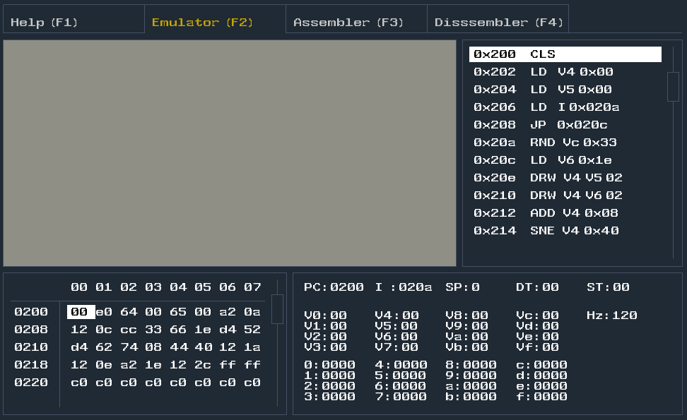

# Chip8


## Reference
<a href="http://devernay.free.fr/hacks/chip8/C8TECH10.HTM">http://devernay.free.fr/hacks/chip8/C8TECH10.HTM</a><br>
<a href="https://github.com/massung/CHIP-8">https://github.com/massung/CHIP-8</a>


Chip-8 is a simple, interpreted, programming language which was first used on some do-it-yourself computer systems in the late 1970s and early 1980s. The COSMAC VIP, DREAM 6800, and ETI 660 computers are a few examples. These computers typically were designed to use a television as a display, had between 1 and 4K of RAM, and used a 16-key hexadecimal keypad for input. The interpreter took up only 512 bytes of memory, and programs, which were entered into the computer in hexadecimal, were even smaller.

### Memory Map:
```
+---------------+= 0xFFF (4095) End of Chip-8 RAM
|               |
|               |
|               |
|               |
|               |
| 0x200 to 0xFFF|
|     Chip-8    |
| Program / Data|
|     Space     |
|               |
|               |
|               |
+- - - - - - - -+= 0x600 (1536) Start of ETI 660 Chip-8 programs
|               |
|               |
|               |
+---------------+= 0x200 (512) Start of most Chip-8 programs
| 0x000 to 0x1FF|
| Reserved for  |
|  interpreter  |
+---------------+= 0x000 (0) Start of Chip-8 RAM
```

### Keyboard
The computers which originally used the Chip-8 Language had a 16-key hexadecimal keypad with the following layout:
```
 1 2 3 C                         1 2 3 4
 4 5 6 D   which mapped into =>  Q W E R
 7 8 9 E   for emulation         A S D F
 A 0 B F                         Z X C V
```

### Display
Chip-8 used a 64x32-pixel monochrome display with this format:
```
<--------- 64 bits --------->
+---------------------------+  ^
|(0,0)	              (63,0)|  |
|                           | 32 bits
|(0,31)	             (63,31)|  |
+---------------------------+  v
```


### Instructions
The original implementation of the Chip-8 language includes 36 different instructions, including math, graphics, and flow control functions.

All instructions are 2 bytes long and are stored most-significant-byte first. In memory, the first byte of each instruction should be located at an even addresses. If a program includes sprite data, it should be padded so any instructions following it will be properly situated in RAM.

### Registers
Chip-8 has 16 general purpose 8-bit registers, usually referred to as Vx, where x is a hexadecimal digit (0 through F). There is also a 16-bit register called I. This register is generally used to store memory addresses, so only the lowest (rightmost) 12 bits are usually used.

The VF register should not be used by any program, as it is used as a flag by some instructions. See section 3.0, Instructions for details.

Chip-8 also has two special purpose 8-bit registers, for the delay and sound timers. When these registers are non-zero, they are automatically decremented at a rate of 60Hz. See the section 2.5, Timers & Sound, for more information on these.

There are also some "pseudo-registers" which are not accessable from Chip-8 programs. The program counter (PC) should be 16-bit, and is used to store the currently executing address. The stack pointer (SP) can be 8-bit, it is used to point to the topmost level of the stack.

The stack is an array of 16 16-bit values, used to store the address that the interpreter shoud return to when finished with a subroutine. Chip-8 allows for up to 16 levels of nested subroutines.


## Contribute
feel free to open issues if any bug found, email me if you have any feedback!!!
